# Dark Optical Sectioning 使用帮助

[TOC]

<a id="quickstart"></a>

## （一）开始使用

### 主界面介绍

软件启动后你会看到以下界面：

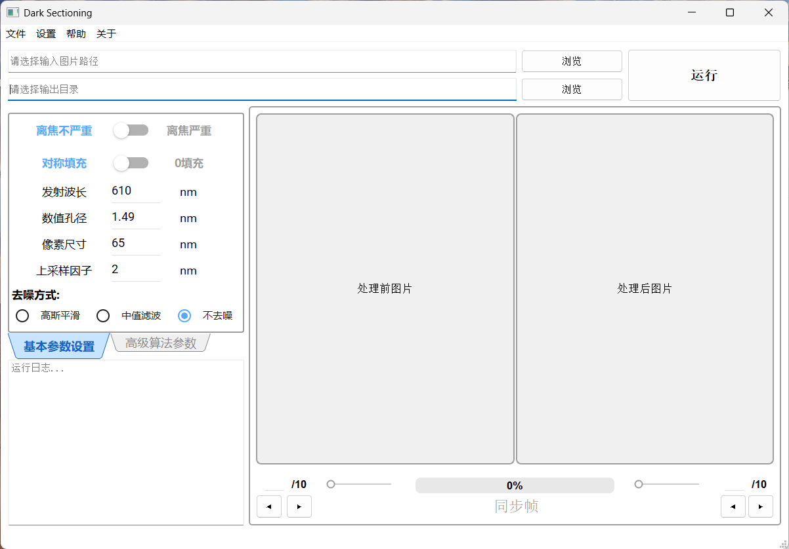


界面主要分为以下几个区域：

**菜单栏区：**"文件"菜单聚合了**图片另存为、导出/导入参数、批量处理**功能入口；"设置"菜单提供**清空输入、恢复默认参数**快捷操作

**路径与操作按钮区：**左侧设置待处理图片输入路径和处理后图片输出路径，右侧为运行按钮

**参数配置区：**设置算法运行所需的各种参数

**图像对比显示区：**展示处理前后的图像对比

**运行日志区：**显示当前运行状态和进度信息 

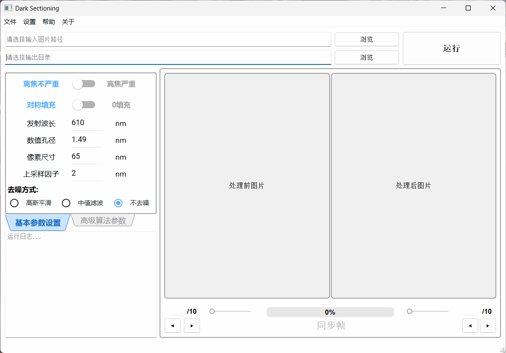


### 第一步：选择输入输出路径

1. 点击**路径与操作按钮区** 的"浏览"按钮，选择要处理的荧光显微镜图像路径：

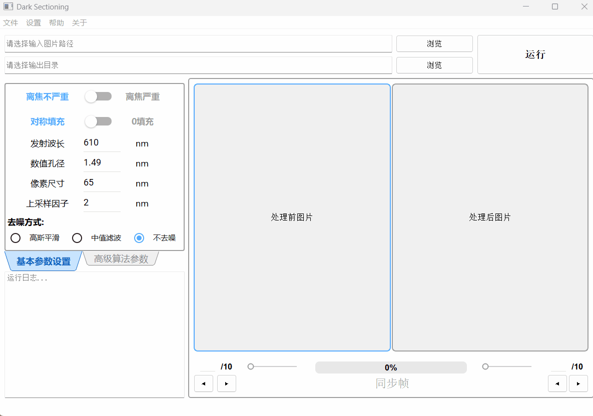
支持的图像格式包括：`.png`、`.jpg`、`.jpeg`、`.tif`、`.tiff`、`.bmp`


2. 点击**路径与操作按钮区** 的第二个"浏览"按钮，选择处理后图像的输出路径：

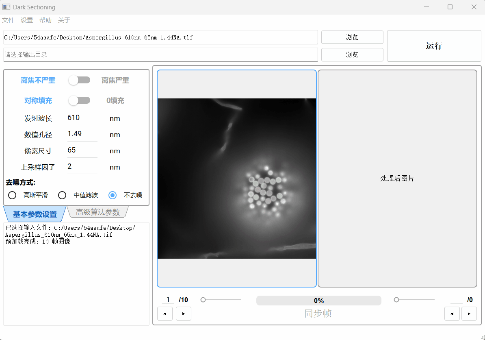
若不选择输出路径，程序将以**桌面为默认输出路径**


**注意：**输入输出路径均需要为全英文路径，软件无法处理含有中文字符的路径


### 第二步：设置基本参数

在**参数配置区** 设置基本参数

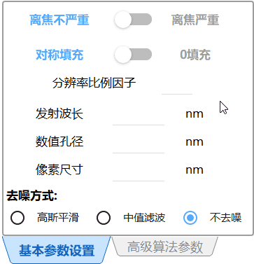


请根据您的荧光显微图像实际参数，填写**基本参数设置**  面板，若不填写，程序会以内置的默认参数处理图像，可能不适用于您的图片。

每个参数的意义如下:

**离焦程度：**选择**"离焦严重"**，程序将进行二次处理；选择**"离焦不严重"**，程序将不进行二次处理

**填充方式：**选择**"对称填充"**，程序将在预处理步骤的边缘填充中，使用对称填充方式；选择**"0填充"**，程序将在预处理步骤的边缘填充中，使用零填充方式

**分辨率比例因子：**调节算法对离焦信号的判定尺度，值越大去背景效果越强，推荐值为0-2

**发射波长：**荧光显微图像的荧光发射波长，单位为 nm 

**数值孔径：**采集图像的显微镜的物镜数值孔径，单位为 nm 

**像素尺寸：**显微镜单个像元对应的样品实际尺寸，单位为 nm 


### 第三步：运行算法

点击**"运行"**按钮，等待算法完成：

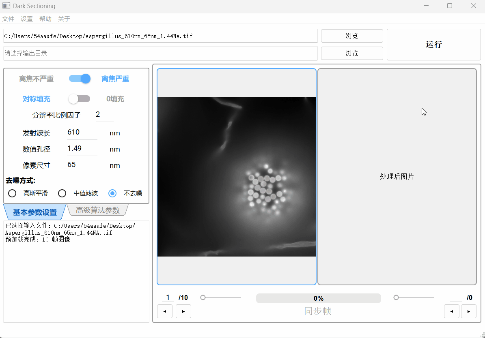

处理完成后，图像对比显示区右侧会显示处理后图像

图像栈将会以`.tif`格式保存在输出路径，文件名为原图像文件名加上后缀"_Darked"


### 完整流程演示

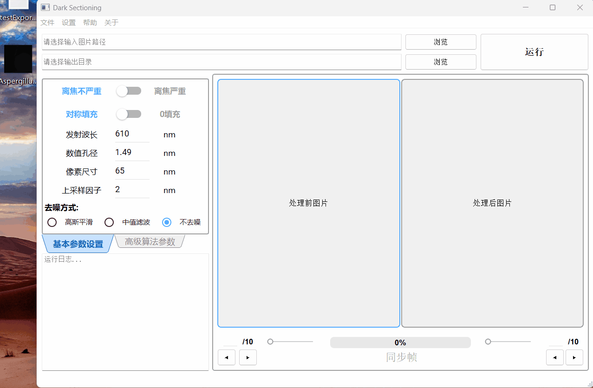


<a id="paramsexplain"></a>

## （二）参数说明

### 高级参数说明

这些参数定义在项目\params目录下的paramsExpert.h内的结构体中，可通过参数配置区的"高级算法参数"面板设置数值

#### thres

划分图像信号与背景的亮度阈值。默认值 70，建议取值范围20~150

在去雾处理中，低于 thres 的像素被视为背景区域，参与暗通道估计和大气光计算；高于 thres 的像素被视为信号区域，不参与。 荧光信号越强，此值应设置得越高 ，以避免将真实信号误判为背景。

**相关代码位置：** dehaze_fast2.cpp：L45-L50 ；


#### divide

划分高频/低频分量的边界系数。默认值 0.5，推荐取值0.5。

控制高通滤波器和低通滤波器的截止频率宽度。 divide 越大，滤波器截止频率越宽。 基本不用调整 ，默认值 0.5 适用于大多数荧光显微图像。

**相关代码与代码位置：** separateHiLo.cpp：L45-L46 

`lp = lpgauss(Nx, Ny, sigmaLP * 2 * divide) ;`
`hp = hpgauss(Nx, Ny, sigmaLP * 2 * divide) ;`


#### padsize

用于边缘渐变填充的尺寸参数。默认值 15，推荐取值范围15~40。

在预处理阶段，图像边缘需要填充以消除傅里叶变换的边界效应；填充行/列数 = floor(Nx / padsize) + 1 。 padsize 越大，填充量越小，边缘过渡越跳跃； padsize 越小，填充量越大，边缘过渡越平滑。处理完成后，图像会按相同尺寸裁剪回原始大小。

**相关代码与代码位置：** 

darkSectioning.cpp：L257-L258		边缘填充：`pad_rows = std::floor(Nx / pad_size) + 1 ` 

darkSectioning.cpp：L327-L328		边缘裁剪： `crop_rows = std::floor(Nx / pad_size) + 1`

darkSectioning.cpp：L389-L397	 去噪后填充与裁剪

darkSectioning_cleanForBatch.cpp：L247-L248

darkSectioning_cleanForBatch.cpp：L289-L290


#### deg

极低通滤波器（EL）的截止频率控制参数。为逗号分隔的多值字符串，默认值 "6,3"，推荐取值 "6,3"。

deg 被用于计算极低通/极高通滤波器：`elp = lpgauss(Nx, Ny, sigmaLP / deg)`。deg 越小 → 滤波器越宽 → EL 保留更多低频信息 → 大气光估计更平滑；deg 越大 → 滤波器越窄 → EL 保留更少低频 → 大气光估计更锐利。当离焦程度选择"离焦严重"时，两个值分别用于第 1 次和第 2 次处理；选择"离焦不严重"时只使用第一个值。

**相关代码与代码位置：** separateHiLo.cpp：L47-L48		

`elp = lpgauss(Nx, Ny, sigmaLP / deg) ;`

`ehp = hpgauss(Nx, Ny, sigmaLP / deg) ;`


#### dep

假设的场景深度系数，用于控制去雾强度。为逗号分隔的多值字符串，默认值 "3,3"，推荐取值 "3,3"。

在暗通道去雾阶段，大气光值被缩放：`rep_atmosphere = dep * rep_atmosphere`。dep 越大 → 大气光估计越高 → 去雾越激进 → 背景移除越强；dep 越小 → 去雾越保守。当离焦程度选择"离焦严重"时，两个值分别用于第 1 次和第 2 次处理；选择"离焦不严重"时只使用第一个值。

**相关代码与代码位置：** 

dehaze_fast2.cpp：L78		`rep_atmosphere_process = dep * rep_atmosphere_process`；


#### hl

高低频融合时的低频加权因子。为逗号分隔的多值字符串，默认值 "1,1"，推荐取值 "1,1"。

最终结果的融合公式为：`result = Lo_process / hl + Hi`。hl 越大 → `Lo_process / hl` 越小 → 低频分量贡献被压制 → 高频细节更突出（去背景更强）；hl 越小 → 低频分量保留更多 → 结果更接近原图。当离焦程度选择"离焦严重"时，两次处理共用同一个 hl第二个值；选择"离焦不严重"时，使用hl第一个值；（hl =  `hl_matrix[maxtime - 1]`）。

**相关代码与代码位置：** 

darkSectioning.cpp：L286		常规模式解析与取值：`hl = hl_matrix[maxtime - 1]`

darkSectioning.cpp：L311		常规模式调取使用：`result = Lo_process / hl + Hi ;`

darkSectioning_cleanForBatch.cpp：L270		批量处理模式解析与取值：`hl = hl_matrix[maxtime - 1]`

darkSectioning_cleanForBatch.cpp：L287		批量处理模式调取使用：`result = Lo_process / hl + Hi ;`


#### isQuick

单帧处理模式开关。默认值 0（多帧处理模式），设置为 1 时启用单帧快速处理。

isQuick 控制算法读取图像栈的帧数：isQuick=1 时只读取并处理第一帧（`Nz = 1`），主要用于快速预览参数效果；isQuick=0 时读取并处理全部帧。该选项可通过参数配置区"高级算法参数"面板下方的**"单帧处理"**复选框勾选设置。

**相关代码与代码位置：**

paramsExpert.h：L24		参数定义：`int isQuick = 0;`

darkSectioning.cpp：L55		读取参数：`int isQuick = paramsExpertSet.isQuick;`

darkSectioning.cpp：L142		判断单帧模式：`if (isQuick == 1)` → `Nz = 1`（仅处理第一帧）

darkSectioning_cleanForBatch.cpp：L38		批量模式读取参数

darkSectioning_cleanForBatch.cpp：L82		批量模式读取缓存值

darkSectioning_cleanForBatch.h：L15		批量模式说明：固定全帧处理（isQuick 恒为 0）


### 基础参数说明

这些参数定义在项目\params目录下的paramsBasic.h内的结构体中，可通过参数配置区的"基本参数设置"面板设置数值

#### background

即**"离焦程度"**，选择**"离焦严重"**，background=1，程序将进行二次处理；选择**"离焦不严重"**，background=0，程序将不进行二次处理

**相关代码与代码位置：**

darkSectioning.cpp：L48		读取参数：`int background = paramsBasicSet.background;`

darkSectioning.cpp：L62-L71		根据 background 值决定处理轮次 maxtime 和高级参数矩阵

darkSectioning_cleanForBatch.cpp：L75		批量模式读取参数：`int background = m_background;`

darkSectioning_cleanForBatch.cpp：L89-L98		批量模式根据 background 值决定处理轮次


#### pad

即**"填充方式"**，选择**"对称填充"**，pad=1，程序将在预处理步骤的边缘填充中，使用对称填充方式；选择**"0填充"**，pad=0，程序将在预处理步骤的边缘填充中，使用零填充方式

**相关代码与代码位置：**

darkSectioning.cpp：L49		读取参数：`int pad = paramsBasicSet.pad;`

darkSectioning.cpp：L253		预处理边缘填充：`if (pad == 1)` → 对称填充，否则零填充

darkSectioning.cpp：L343		二次处理时重新填充边缘

darkSectioning.cpp：L382		去噪后填充边缘

darkSectioning_cleanForBatch.cpp：L76		批量模式读取参数

darkSectioning_cleanForBatch.cpp：L244		批量模式预处理边缘填充

darkSectioning_cleanForBatch.cpp：L311		批量模式二次处理时重新填充边缘

darkSectioning_cleanForBatch.cpp：L345		批量模式去噪后填充边缘


#### factor

即**"分辨率比例因子"**，调节算法对离焦信号的判定尺度，值越大去背景效果越强，推荐值为0-2。factor 用于计算光学分辨率：`res = 0.5 * emwavelength / NA / factor`，factor 越大 → res 越小 → 截止频率越高 → 高低频分离保留更多高频细节

**相关代码与代码位置：**

separateHiLo.cpp：L34		读取参数：`double factor = paramsBasicSet.factor;`

separateHiLo.cpp：L38		计算分辨率：`res = 0.5 * emwavelength / NA / factor;`

confirm_block.cpp：L35		PSF 生成：`PSF_Generator(paramsBasicSet.emwavelength, paramsBasicSet.pixelsize, paramsBasicSet.NA, paramsBasicSet.Nx, paramsBasicSet.factor);`


#### emwavelength

即**"发射波长"**，荧光显微图像的荧光发射波长，单位为 nm。emwavelength 用于计算光学分辨率和点扩散函数（PSF）

**相关代码与代码位置：**

separateHiLo.cpp：L33		读取参数：`double emwavelength = paramsBasicSet.emwavelength;`

separateHiLo.cpp：L38		计算分辨率：`res = 0.5 * emwavelength / NA / factor;`

confirm_block.cpp：L35		PSF 生成：`PSF_Generator(paramsBasicSet.emwavelength, paramsBasicSet.pixelsize, paramsBasicSet.NA, paramsBasicSet.Nx, paramsBasicSet.factor);`


#### NA

即**"数值孔径"**，采集图像的显微镜的物镜数值孔径，单位为 nm。NA 用于计算光学分辨率和点扩散函数（PSF）

**相关代码与代码位置：**

separateHiLo.cpp：L32		读取参数：`double NA = paramsBasicSet.NA;`

separateHiLo.cpp：L38		计算分辨率：`res = 0.5 * emwavelength / NA / factor;`

confirm_block.cpp：L35		PSF 生成：`PSF_Generator(paramsBasicSet.emwavelength, paramsBasicSet.pixelsize, paramsBasicSet.NA, paramsBasicSet.Nx, paramsBasicSet.factor);`


#### pixelsize

即**"像素尺寸"**，显微镜单个像元对应的样品实际尺寸，单位为 nm。pixelsize 用于计算物镜截止频率：`k_m = Ny / (res / pixel_size)`

**相关代码与代码位置：**

separateHiLo.cpp：L35		读取参数：`double pixel_size = paramsBasicSet.pixelsize;`

separateHiLo.cpp：L39		计算截止频率：`k_m = Ny / (res / pixel_size);`

confirm_block.cpp：L35		PSF 生成：`PSF_Generator(paramsBasicSet.emwavelength, paramsBasicSet.pixelsize, paramsBasicSet.NA, paramsBasicSet.Nx, paramsBasicSet.factor);`


#### denoise

即**"去噪方式"**，选择**"不去噪"**，denoise=0，程序不进行后处理去噪；选择**"高斯平滑"**，denoise=1，程序对结果图像执行高斯滤波去噪；选择**"中值滤波"**，denoise=2，程序对结果图像执行 MDBUTMF 改进中值滤波（支持16位深）

**相关代码与代码位置：**

darkSectioning.cpp：L50		读取参数：`int denoise = paramsBasicSet.denoise;`

darkSectioning.cpp：L376		不去噪分支：`if (denoise == 0)` → 直接使用原始结果

darkSectioning.cpp：L379		高斯平滑分支：`else if(denoise == 1)` → 填充→高斯模糊→裁剪

darkSectioning.cpp：L402		中值滤波分支：`else if(denoise == 2)` → 预备使用 MDBUTMF 改进中值滤波

darkSectioning.cpp：L446-L452		中值滤波执行：`if (denoise == 2)` → `final_image = applyMDBUTMF(final_image);`

darkSectioning_cleanForBatch.cpp：L77		批量模式读取参数

darkSectioning_cleanForBatch.cpp：L339		批量模式不去噪分支

darkSectioning_cleanForBatch.cpp：L342		批量模式高斯平滑分支

darkSectioning_cleanForBatch.cpp：L365		批量模式中值滤波分支

darkSectioning_cleanForBatch.cpp：L421-L427		批量模式中值滤波执行：`if (denoise == 2)` → `final_image = applyMDBUTMF(final_image);`


<a id="batchuse"></a>

## （三）使用批量处理
**功能介绍：**针对同批次大量样本可使用相同参数的场景，您可以使用批量处理功能。在您指定输入目录、输出目录、参数配置文件并点击运行后，软件会自动遍历输入目录，记录该文件夹下的所有图像，之后循环调用算法逐一处理所有图像，实时输出进度日志。循环处理中内置中文路径检测和文件级容错机制， 确保单张失败不影响整体任务。


### 功能入口

"批量处理"功能的入口在菜单栏的**"文件"菜单末行**

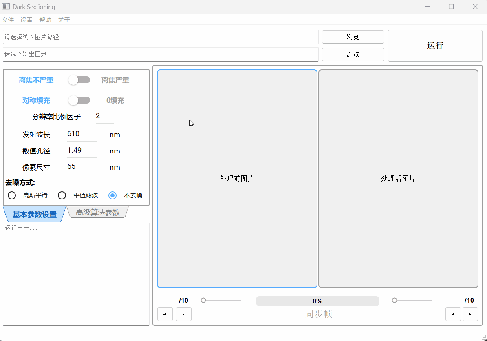


### 第一步：获取参数文件

算法运行一次后，使用菜单栏的**"文件"**菜单下的 **"导出算法所用参数"**功能，导出参数文件

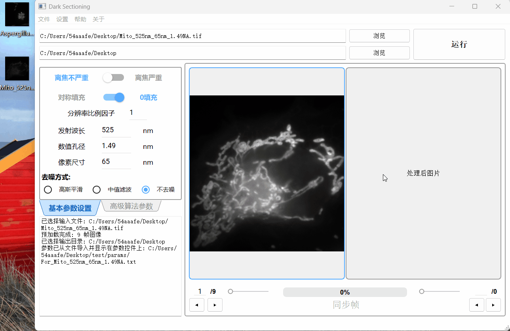

建议使用**"单帧处理"**功能寻找同批次图像的最佳参数

**注意：** **"导出算法所用参数"**功能导出的是算法内部储存的参数值，而非主界面上参数设置面板显示的值。只有在点击"运行"后，参数设置面板上显示的值才会导入算法内部。若您未进行初次运行就导出参数，导出的将是内置的默认初始参数。


### 第二步：选择路径

先将您需要处理的所有图像放在同一个文件夹下，之后在批量处理窗口选择输入目录、输出目录、参数文件的路径

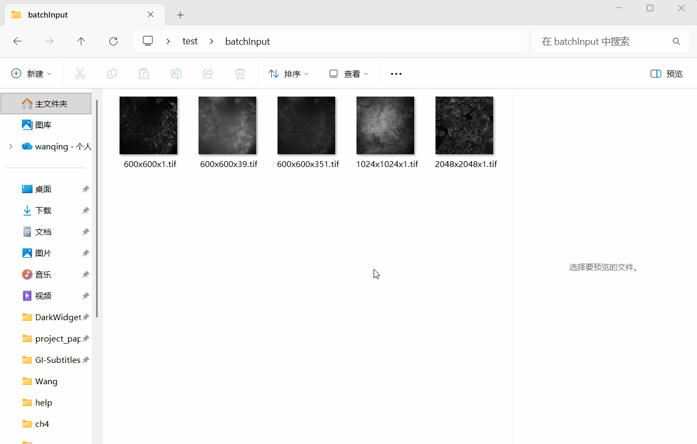

**注意：**所有路径均需要为全英文路径，软件无法处理含有中文字符的路径


### 第三步：运行算法

点击运行，软件将逐一处理所有图像，实时输出进度日志，所有处理后图像都将以`.tif`格式保存在输出目录下，所有文件名均为原图像文件名加上后缀"_Darked"

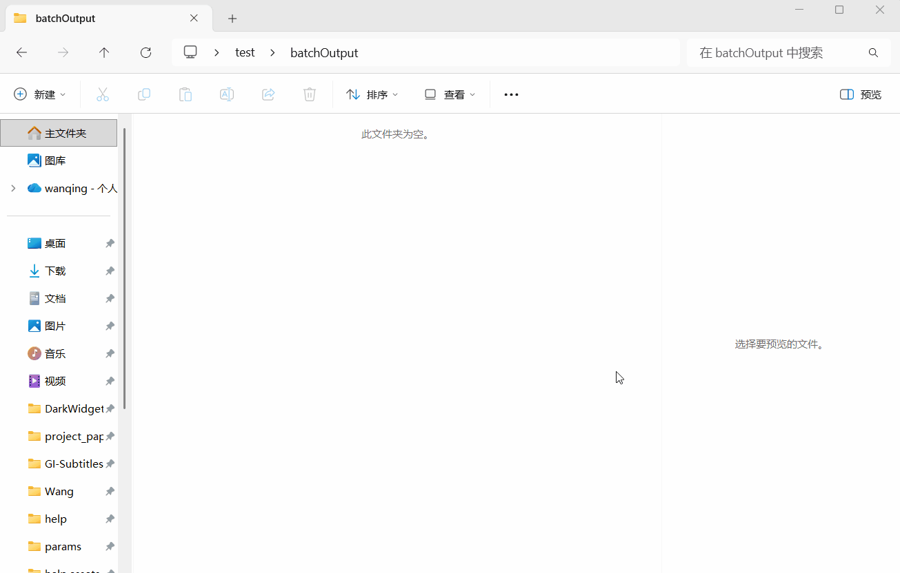


<a id="codeexplain"></a>

## （四）项目源码说明

本项目是基于 [Dark-sectioning](https://github.com/Cao-ruijie/Dark-sectioning) 项目的 MATLAB 代码，使用 C++/Qt 进行的移植与重构，并添加了图形用户界面。

**技术栈：** OpenCV 4.10.0、Qt 5.14.2（MinGW 64-bit）、Qt Creator 4.11.1、Qt Widgets Application（基类 QMainWindow）、qmake（.pro）、MinGW 7.3.0 64-bit C++编译器

**源项目论文：** *Dark-based optical sectioning assists background removal in fluorescence microscopy*


### 项目结构

```
Dark_WidgetsMaterial_V1_0_0/
├── main.cpp                          // 程序入口
├── Dark_WidgetsMaterial_V1_0_0.pro   // qmake 工程文件
│
├── algorithm/                        // 算法层：核心图像处理算法
│   ├── darkSectioning.cpp/h              // 单帧处理主流程
│   ├── darkSectioning_cleanForBatch.cpp/h // 批量处理主流程（继承 darkSectioning）
│   ├── separateHiLo.cpp                  // 高低频分离
│   ├── dehaze_fast2.cpp                  // 暗通道去雾
│   ├── confirm_block.cpp                 // 腐蚀核尺寸确定
│   ├── PSF_Generator.cpp                 // 点扩散函数（PSF）生成
│   ├── get_dark_channel.cpp              // 暗通道计算
│   ├── get_atmosphere.cpp                // 大气光估计
│   ├── get_transmission_estimate.cpp     // 透射率初始估计
│   ├── get_radiance.cpp                  // 辐照度恢复
│   ├── get_laplacian.cpp                 // 拉普拉斯滤波器
│   ├── guided_filter.cpp                 // 引导滤波
│   ├── window_sum_filter.cpp             // 窗口求和滤波
│   └── port_matlab2opencv.cpp/h          // MATLAB→OpenCV 移植辅助函数
│
├── ui/                               // 界面层：Qt 界面控件与交互逻辑
│   ├── mainwindow.cpp/h/ui               // 主窗口（菜单栏、路径选择、参数面板、图像显示、日志）
│   ├── orangewidget.cpp/h/ui             // 橙区控件（图像对比显示区）
│   ├── orangebar.cpp/h/ui                // 进度条控件
│   ├── greenwidget.cpp/h/ui              // 绿区控件（参数配置区，含基本参数和高级参数两页）
│   ├── batchdialog.cpp/h/ui              // 批量处理对话框
│   └── aboutdialog.cpp/h                 // 关于对话框
│
├── params/                           // 参数传递头文件
│   ├── paramsBasic.h                     // 基本参数结构体
│   └── paramsExpert.h                    // 高级参数结构体与将字符串解析为vector的辅助函数
│
├── verify/                           // 调试辅助工具（仅调试用，正式构建不参与）
│   └── ViewMat.cpp/h                    // 将OpenCV::Mat输出为.csv文件
│
├── help/                             // 帮助文档
│   ├── help.md                           // Markdown 源文件
│   ├── help.html                         // Typora 导出的 HTML 渲染文件
│   └── help.assets/                     // 帮助文档使用的图片和 GIF 动图
│
└── SDK/Material/                      // 第三方控件库：qt-material-widgets
    ├── components/                       // 控件源码与头文件（按钮、滑块、文本框等Material组件）
    │   ├── icons/                            // Material Design 图标资源（SVG）
    │   ├── lib/                              // 库内部实现（主题、样式、涟漪效果等）
    │   └── layouts/                          // 布局辅助组件
    ├── staticlib/                        // 预编译静态库（libcomponents.a）
    └── fonts/                            // Roboto 字体文件（Material Design 标准字体）
```


